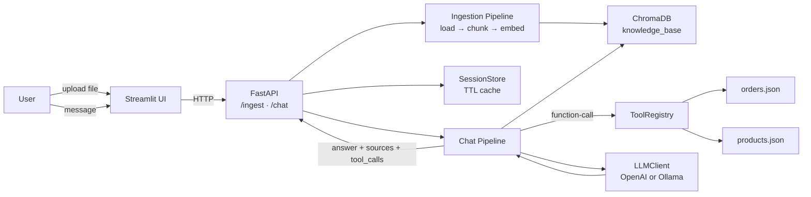
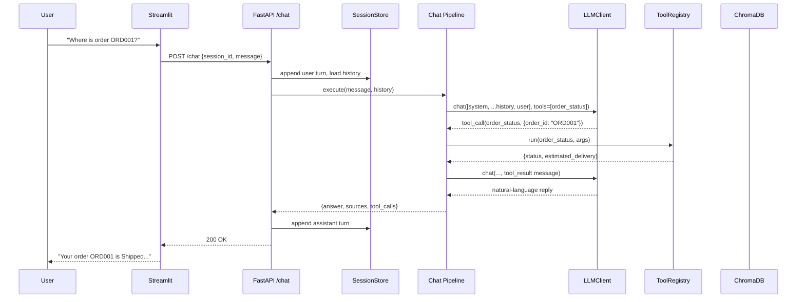
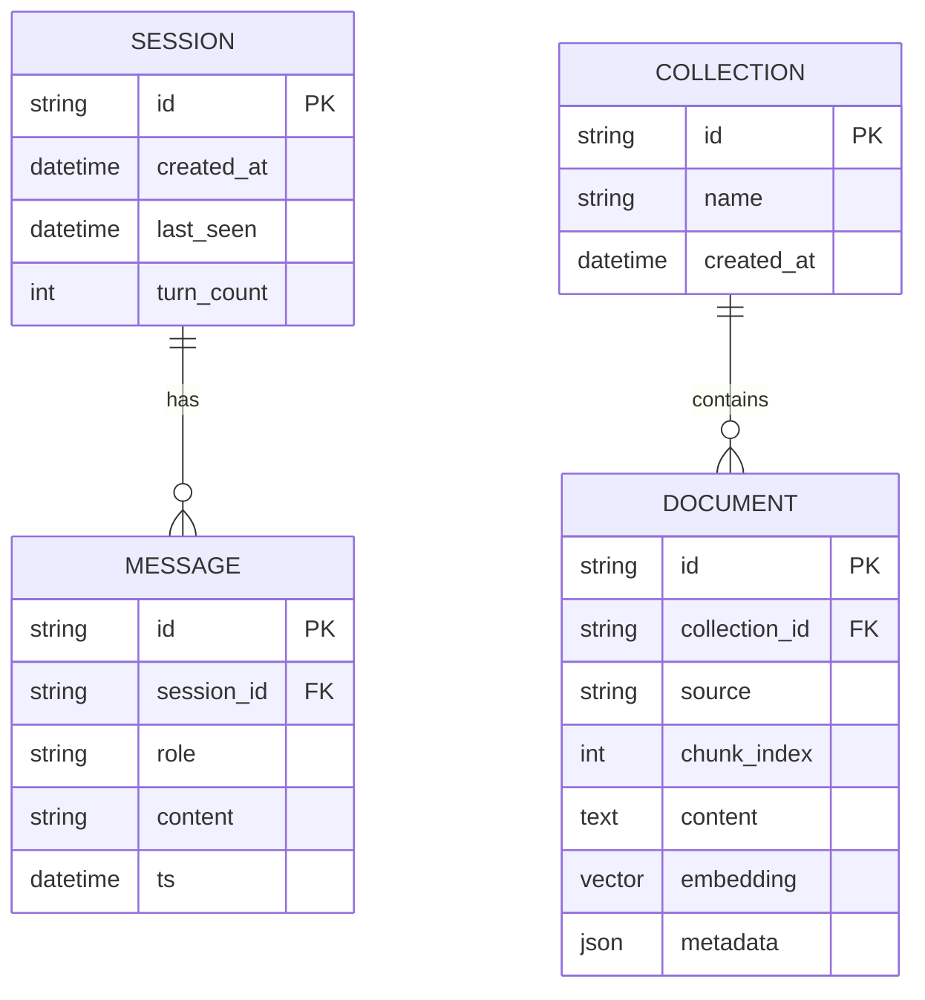

## Plan: Mini AI Assistant Take-Home

**TL;DR**
A FastAPI service exposes `/ingest` (PDF/TXT/MD → chunks → embeddings → ChromaDB) and `/chat` (session memory + tool calling + RAG). Tools (`order_status`, `product_search`) are registered with JSON schemas and invoked via LLM function-calling. A Streamlit UI provides a no-friction front end. Architecture and sequence diagrams are authored in Mermaid and rendered to PNG.

**Design decisions**
- **Vector DB**: ChromaDB over FAISS — persistent on disk, metadata filtering out-of-the-box, less boilerplate. FAISS remains a one-file swap behind a `VectorStore` interface.
- **LLM**: OpenAI (`gpt-4o-mini`) by default for chat + `text-embedding-3-small` for embeddings; an Ollama/local backend is wired behind a `LLMClient` interface so it can be swapped with a single env change.
- **Routing**: OpenAI function-calling drives tool selection. When no tool is chosen, the pipeline falls through to retrieval-augmented generation; if retrieval returns no hits above threshold, the model answers directly with the documented "couldn't find" fallback.
- **Memory**: In-process dict keyed by `session_id` (TTL via `cachetools.TTLCache`). Redis is mentioned in the README as a drop-in upgrade but not required.
- **UI**: Streamlit — keeps the project to one language, one process for demo, easy to swap for React/Next.js later.
- **No over-engineering**: No LangChain. Direct SDK calls keep each layer explicit and easy to test (matches the "code quality" criterion).

**Project layout**
```
mini-ai-assistant/
├── backend/
│   ├── main.py                  # FastAPI app + lifespan (loads Chroma + tools)
│   ├── config.py                # Pydantic Settings (env-driven)
│   ├── schemas.py               # Request/response models
│   ├── ingestion/
│   │   ├── loaders.py           # PDF (pypdf), TXT, MD readers
│   │   ├── chunker.py           # RecursiveCharacterTextSplitter
│   │   └── pipeline.py          # load → split → embed → upsert
│   ├── vector_store/
│   │   └── chroma_store.py      # ChromaStore class (add, query, delete)
│   ├── llm/
│   │   ├── client.py            # LLMClient interface + OpenAIClient / OllamaClient
│   │   └── prompts.py           # SYSTEM_PROMPT, RAG_TEMPLATE, NO_CONTEXT_FALLBACK
│   ├── memory/
│   │   └── session_store.py     # TTLCache-based session history
│   ├── tools/
│   │   ├── registry.py          # Tool dataclass + register() helper
│   │   ├── order_status.py      # reads data/orders.json
│   │   └── product_search.py    # reads data/products.json
│   ├── router/
│   │   ├── chat.py              # /chat — the orchestrator (calls pipeline)
│   │   ├── ingest.py            # /ingest — runs ingestion pipeline
│   │   └── pipeline.py          # decide(retrieve|tool|direct) → execute → respond
│   └── utils/
│       └── dispatch.py          # file-type dispatch
├── data/
│   ├── orders.json
│   └── products.json
├── ui/
│   └── streamlit_app.py         # upload + chat interface
├── docs/
│   ├── architecture.md          # Mermaid sources
│   └── architecture.png         # committed render
├── tests/
│   ├── test_ingestion.py
│   ├── test_chat.py
│   ├── test_tools.py
│   └── test_memory.py
├── .env.example
├── requirements.txt
└── README.md
```

**Steps**
1. **Scaffold repo + deps** — create folder tree, `requirements.txt` (fastapi, uvicorn, pydantic-settings, chromadb, openai, pypdf, tiktoken, streamlit, cachetools, httpx, pytest), `.env.example`, `README.md` skeleton. (parallel with 2)
2. **Data + tools** — author `data/orders.json` and `data/products.json` with the sample records plus a few extras; implement `tools/order_status.py` and `tools/product_search.py` returning JSON-serialisable dicts; register both in `tools/registry.py` with `name`, `description`, JSON `parameters` schema, and `run(args)`. (parallel with 3)
3. **Vector store + ingestion** — `chroma_store.py` (persistent client under `./.chroma`, single collection `knowledge_base`, methods `add_documents`, `similarity_search`, `delete_all`); loaders for PDF (pypdf), TXT, MD; `chunker.py` uses `RecursiveCharacterTextSplitter` with `chunk_size=800`, `chunk_overlap=120`; `pipeline.py` orchestrates end-to-end and metadata-stamps each chunk with `source`, `chunk_index`, `uploaded_at`. (parallel with 2)
4. **LLM client + prompts** — `LLMClient` interface exposing `chat(messages, tools=...) -> {content, tool_calls}`; `OpenAIClient` wraps `openai` SDK; `prompts.py` defines `SYSTEM_PROMPT` (persona + rules: when to say "I couldn't find that information in the uploaded documents.") and `build_rag_prompt(context_chunks, history, query)`. (depends on 2)
5. **Memory** — `session_store.py` using `cachetools.TTLCache(maxsize=1000, ttl=3600)`; methods `get(session_id)`, `append(session_id, role, content)`, `clear(session_id)`; keep last N turns configurable. (parallel with 4)
6. **Chat pipeline (the orchestrator)** — `router/pipeline.py.execute(message, session_id)`:
   1. Append user turn to memory, fetch history (last 10 turns).
   2. Call `LLMClient.chat([system, ...history, user], tools=tool_schemas)`.
   3. If `tool_calls` returned → execute via `ToolRegistry`, append tool result message, call LLM again for final natural-language reply.
   4. Else retrieve top-k=4 chunks from Chroma; if max similarity < threshold (e.g., 0.25) → use `NO_CONTEXT_FALLBACK` ("I couldn't find…"); else build RAG prompt and call LLM.
   5. Append assistant turn to memory; return `{answer, sources, tool_calls}`. (depends on 2, 3, 4, 5)
7. **FastAPI routes** — `POST /ingest` (multipart file upload → ingestion pipeline → `{collection_size, source}`); `POST /chat` (`{session_id, message}` → pipeline result); `POST /session/{id}/reset`; `GET /healthz`. (depends on 3, 6)
8. **Streamlit UI** — left pane: file uploader + "Upload" button hitting `/ingest`, collection stats; right pane: chat history with `session_id` (uuid stored in `st.session_state`), input box hitting `/chat` and rendering `answer` + collapsible "Sources" + "Tool calls used" sections. Stays decoupled from backend so it can be replaced. (depends on 7)
9. **Architecture diagram + README** — author Mermaid `flowchart` (overall) and `sequenceDiagram` (chat request) in `docs/architecture.md`; export to `docs/architecture.png` via `mermaid-cli` (one-shot `mmdc` run documented in README); README covers setup, env vars, run instructions, samples, evaluation rubric mapping. (depends on 1)
10. **Tests + error handling** — pytest fixtures using a mock `LLMClient`; cover: chunker boundaries, vector-store add/query, both tools happy + not-found, memory TTL eviction, chat pipeline for each of the four flows (pure retrieval, tool call, conversational reference, out-of-scope fallback). Add global exception handler in `main.py` returning structured `{error, detail}`. (depends on 7)

**Relevant files**
- `backend/router/pipeline.py` — orchestrates tool/retrieval/direct decision; the single place implementing requirement §5.
- `backend/vector_store/chroma_store.py` — abstraction that lets FAISS swap in.
- `backend/tools/registry.py` — JSON schema definitions consumed by OpenAI function-calling.
- `backend/memory/session_store.py` — session-scoped context (requirement §3).
- `backend/ingestion/pipeline.py` — load → chunk → embed → upsert (requirement §1).
- `docs/architecture.md` — Mermaid sources rendering to `docs/architecture.png`.

**Diagrams**







**Verification**
1. `pytest -q` — all unit tests pass (ingestion, retrieval, tools, memory, pipeline flows).
2. `uvicorn backend.main:app --reload` + `streamlit run ui/streamlit_app.py`.
3. Upload a sample PDF/TXT/MD; `/healthz` reports collection size > 0.
4. Manual chat scenarios:
   - "My name is John." → follow-up "What's my name?" → "Your name is John." (memory)
   - "Where is ORD001?" → tool-calls `order_status`, returns "Shipped, ETA …".
   - "Do you have a wireless mouse?" → tool-calls `product_search`, returns availability.
   - "I'm looking for a laptop." → "Show me cheaper options." → resolves "cheaper options" → laptops (context + retrieval).
   - Off-scope question with no relevant docs → exact fallback sentence (pipeline step 6.4).
5. `GET /chat` trace shows `tool_calls` and `sources` arrays populated correctly.
6. `docs/architecture.png` renders both Mermaid diagrams cleanly; README walkthrough matches the running app.
