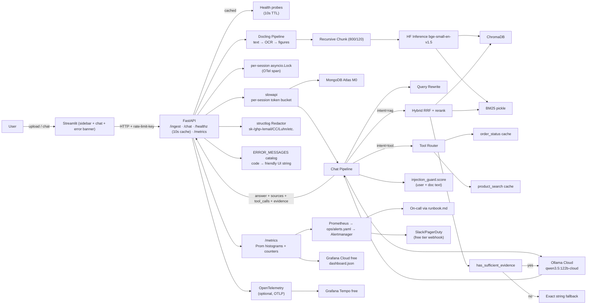
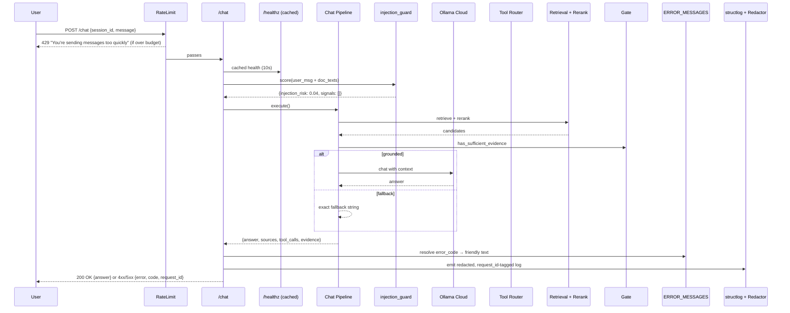
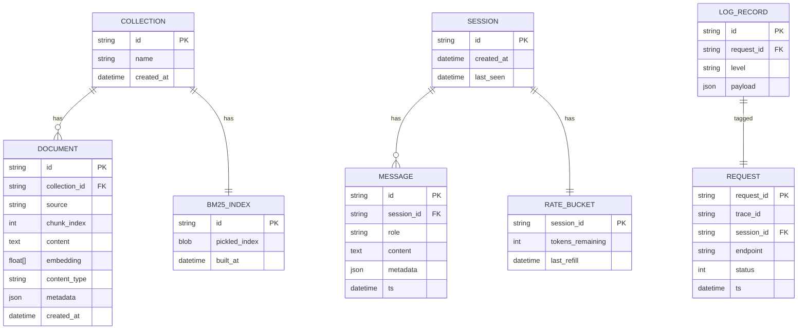

## Plan: Mini AI Assistant Take-Home (v2.2) — observability + error-handling hardening

**TL;DR**
Same architecture as v2.1 (Ollama Cloud `qwen3.5:122b-cloud` + HF embeddings, Docling staged parse, hybrid BM25+dense + reranker + multi-signal answerability gate, MongoDB Atlas free memory, per-session `asyncio.Lock`, Streamlit UI, no LangChain, explicit JSON-intent tool router). **What's new in v2.2:** eight concrete hardening items that previously lived as "follow-ups in README" now become first-class plan todos with acceptance criteria. Existing todos renumbered; nothing in the data flow breaks.

**New design decisions (the 8 hardening items)**

| # | Item | Where it lives | Why first-class |
|---|------|----------------|-----------------|
| 1 | Prometheus `alerts.yaml` + Grafana dashboard JSON | `ops/alerts.yaml`, `ops/grafana/dashboard.json`, README run-book | Metrics without alerts are dashboards no one watches |
| 2 | Per-session token-bucket rate limit on `/chat` | `backend/security/rate_limit.py` (`slowapi` backend) | One noisy user can monopolise the fallback chain |
| 3 | Prompt-injection test corpus | `tests/test_injection.py`, `tests/fixtures/injections.jsonl` | User-uploaded PDFs can contain injection text |
| 4 | PII / secret redaction in logs | `backend/observability/redactor.py` + `structlog` filter | API keys, emails, sk-/ghp-/aws- prefixes in prompts would get logged verbatim today |
| 5 | `/healthz` 10-second cache | `backend/observability/health.py` | Health pings hit Ollama every call — costs Free-tier budget |
| 6 | OpenTelemetry tracing (optional, free-tier compatible) | `backend/observability/tracing.py`, OTLP push to Grafana Tempo free | `structlog` correlates within Python only; can't follow a request into Ollama/HF |
| 7 | Log rotation (50 MB × 5 files) | `backend/observability/logging_config.py` (RotatingFileHandler) | Streamlit demo on a laptop will fill the disk eventually |
| 8 | Friendly error-code → UI message mapping | `backend/errors.py` (code catalog) + `ui/streamlit_app.py` (render layer) | 502 "something went wrong" → user-friendly "rate-limited, retry in 30s" |

**Project layout (additions to v2.1)**
```
mini-ai-assistant/
├── backend/                        # same as v2.1, plus:
│   ├── errors.py                   # + ERROR_MESSAGES catalog (item 8)
│   ├── security/
│   │   ├── rate_limit.py           # item 2: per-session token bucket
│   │   └── injection_guard.py      # item 3: prompt-injection detector + sanitizer
│   └── observability/
│       ├── logging_config.py       # + RotatingFileHandler (item 7)
│       ├── redactor.py             # item 4: PII / secret patterns
│       ├── health.py               # item 5: cached health pings
│       └── tracing.py              # item 6: OTel OTLP exporter (optional)
├── ui/streamlit_app.py             # + error-code → friendly banner (item 8)
├── ops/                            # NEW top-level dir
│   ├── alerts.yaml                 # item 1: Prometheus alert rules
│   ├── prometheus.yml              # scrape config (local / Grafana remote-write)
│   └── grafana/dashboard.json      # item 1: pre-built dashboard
└── tests/                          # same as v2.1, plus:
    ├── test_injection.py           # item 3
    ├── test_rate_limit.py          # item 2
    ├── test_redactor.py            # item 4
    ├── test_health_cache.py        # item 5
    ├── test_logging_rotation.py    # item 7
    └── fixtures/injections.jsonl   # item 3
```

**Revised steps (incremental on top of v2.1's 1–12)**

1. **Scaffold repo + deps (parallel 2–15)** — `requirements.txt` adds `slowapi`, `opentelemetry-api`, `opentelemetry-sdk`, `opentelemetry-exporter-otlp`, `pytest-httpx` for injection tests. `.env.example` adds `RATE_LIMIT_PER_MIN`, `HEALTH_CACHE_TTL_SECONDS`, `OTEL_EXPORTER_OTLP_ENDPOINT` (optional/empty by default), `LOG_DIR`, `LOG_MAX_BYTES`, `LOG_BACKUP_COUNT`.
2. **Data + tools with caches** — unchanged.
3. **Docling staged extractor** — unchanged, but ingestion logs now include `ocr_pages`, `figure_descriptions` counts on every ingest (per item 1 metrics).
4. **Vector store + chunker + ingestion** — unchanged.
5. **Ollama Cloud client + prompts + tool router** — unchanged; new: `trace_llm_call` decorator (item 6) wraps the client so OTEL spans emit when enabled.
6. **Hybrid retrieval + rerank + answerability gate** — unchanged; new: `trace_retrieve` decorator emits OTel spans `retrieve`, `rerank`, `gate.evaluate` when OTEL is on.
7. **Mongo memory + per-session locks** — unchanged; locks gain OpenTelemetry span (`lock.acquire.duration_ms`) for monitoring.
8. **Chat pipeline** — unchanged; per-stage timings move from being custom-logged only to also flowing into OTel spans (when enabled) and Prometheus histograms as before.
9. **FastAPI routes + observability + errors** — unchanged command surface, but the route layer now wires up: cached health (item 5), redacting structlog (item 4), per-session rate limit (item 2), OTel middleware (item 6), and the friendly error envelope (item 8).
10. **Streamlit UI** — gains the friendly-error banner that maps `code` to a user-readable string.
11. **Architecture + decisions docs** — `docs/decisions.md` adds `ADR-005 health caching`, `ADR-006 OTel optionality`, `ADR-007 redaction policy`, `ADR-008 injection defense (detection + LLM instruction)`. `docs/runbook.md` is new — incident response for the alert rules.
12. **Tests + error handling (v2.1 baseline)** — unchanged ~36 cases.

13. **NEW — Item 4: PII / secret redaction.** `backend/observability/redactor.py` exposes `redact(value: str) -> str` that masks known patterns: `sk-*` (OpenAI/Ollama-style), `ghp_*`, `xox[bpars]-*` (Slack), AWS access keys, JWTs, IPv4 addresses in IPv6 contexts, emails (`<user>@<host>`), credit-card-shaped numerics (Luhn-checked). Wired into `structlog` via a `Processor` and into the `/chat` request log so prompts don't leak. **Acceptance:** `tests/test_redactor.py` covers 8 patterns × 3 variants; logs of a message containing `sk-abc12345def` show the masked form.
14. **NEW — Item 5: `/healthz` cache.** `backend/observability/health.py` provides `cached_health(ttl=10s)` that returns the last result within TTL, otherwise pings in parallel. **Acceptance:** `tests/test_health_cache.py` asserts (a) second call within 10s doesn't hit Ollama (mock count = 0), (b) after TTL expiry it does.
15. **NEW — Item 7: Log rotation.** `backend/observability/logging_config.py` switches to `RotatingFileHandler(filename=LOG_DIR/app.log, maxBytes=50MB, backupCount=5)` plus a stderr handler. **Acceptance:** `tests/test_logging_rotation.py` writes 60 MB worth of logs and asserts at most 6 files exist on disk.
16. **NEW — Item 8: Friendly error catalog.** `errors.py` exposes `ERROR_MESSAGES: dict[str, str]` (e.g., `{"rate_limited": "You're sending messages too quickly — please wait a moment.", "llm_unavailable": "The language service is temporarily down. Please try again in a few seconds.", "retriever_empty": "I couldn't find that information in the uploaded documents.", ...}`). FastAPI exception handler emits `{error: message, code, request_id}`. UI renders friendly banner; technical `detail` shown in a collapsible "Details" expander. **Acceptance:** `tests/test_error_handling.py` extended with 6 codes.
17. **NEW — Item 2: Per-session rate limit.** `slowapi` with a custom key function on `request.json().session_id` (fallback to IP); default `30/min`. Returns 429 with `code: "rate_limited"` + `Retry-After` header. Token bucket per session. **Acceptance:** `tests/test_rate_limit.py` sends 31 messages in 60s from one `session_id` and asserts the 31st returns 429 with `Retry-After`.
18. **NEW — Item 3: Prompt-injection defense.** `backend/security/injection_guard.py` runs two defenses: (a) **input detector** — simple high-signal regex/keyword corpus matching "ignore previous instructions", "you are now", "system:" role prepending, etc., on *user* messages and uploaded PDF text. (b) **LLM instruction** — system prompt explicitly forbids acting on injected directives from documents. Detector triggers add `metadata.injection_risk=True`; the chat pipeline records it in metrics (`prompt_injection_total`) and in the log line. **Acceptance:** `tests/test_injection.py` runs the `fixtures/injections.jsonl` (≥20 known attacks, ≥5 known-benign) through `injection_guard.score` and asserts (a) every known attack scores ≥ 0.7, (b) benign queries score ≤ 0.3, (c) the chat pipeline returns an unmodified or scrubbed answer when an injection is detected (no tool calls, no instruction following).
19. **NEW — Item 6: OpenTelemetry (optional).** `backend/observability/tracing.py` initialises OTel SDK only when `OTEL_EXPORTER_OTLP_ENDPOINT` is set. Spans: `http.server.request` (FastAPI middleware), `llm.chat`, `retriever.query`, `reranker.rank`, `gate.evaluate`, `tool.run`, `mongo.append`. README documents pushing to Grafana Tempo free tier (50 GB traces/mo). **Acceptance:** when the env var is set, a manual `curl` to `/chat` shows all named spans; when unset, zero OTel code runs (test asserts the SDK was not imported).
20. **NEW — Item 1: Alerts + dashboard.** `ops/alerts.yaml` ships five Prometheus rules; `ops/grafana/dashboard.json` ships four panels. README "Runbook" section (`docs/runbook.md`) walks through each alert's meaning and the on-call response. **Acceptance:** the YAML validates with `promtool check rules`; the dashboard JSON parses; `docs/runbook.md` has one section per alert.

**Specific Prometheus alert rules (the alert names are stable)**

```yaml
# ops/alerts.yaml
groups:
  - name: ai_assistant.rules
    rules:
      - alert: HighLatencyLLM
        expr: histogram_quantile(0.99, sum by (le) (rate(request_stage_seconds_bucket{stage="llm"}[5m]))) > 8
        for: 5m
        labels: { severity: page }
        annotations:
          summary: "p99 LLM latency > 8s for 5m"
      - alert: HighFallbackRate
        expr: sum(rate(answerability_decisions_total{decision="fallback"}[10m])) / sum(rate(answerability_decisions_total[10m])) > 0.30
        for: 10m
        labels: { severity: warn }
        annotations:
          summary: "RAG fallback rate > 30% for 10m — retrieval likely regressing"
      - alert: HighErrorRate
        expr: sum(rate(http_requests_total{status=~"5.."}[5m])) / sum(rate(http_requests_total[5m])) > 0.01
        for: 5m
        labels: { severity: page }
        annotations:
          summary: "HTTP 5xx rate > 1% for 5m"
      - alert: VectorStoreDown
        expr: up{job="chroma"} == 0 or absent(up{job="chroma"})
        for: 2m
        labels: { severity: page }
        annotations:
          summary: "Chroma not responding to scrape"
      - alert: HealthCheckDegraded
        expr: sum by (component) (health_status{status="down"} == 1) > 0
        for: 2m
        labels: { severity: page }
        annotations:
          summary: "Dependency {{ $labels.component }} reporting down"
      - alert: PromptInjectionSpike
        expr: sum(rate(prompt_injection_total[5m])) > 0.5
        for: 10m
        labels: { severity: warn }
        annotations:
          summary: "Elevated prompt-injection attempts — review document uploads"
```

**Specific Grafana dashboard panels (in `ops/grafana/dashboard.json`)**
- "Overview" — request rate, error rate, p50/p99 latency by stage.
- "RAG health" — answerability decisions (grounded vs fallback), retrieval top-k rerank score distribution.
- "Tool calls" — calls/min by tool, tool error rate.
- "Capacity" — concurrent locks held, MongoDB connection pool, Chroma collection size, embedding queue depth.

**Docs added (incremental on v2.1)**
- `docs/runbook.md` (NEW) — five sections, one per alert in `alerts.yaml`, with detection, impact, mitigation. Mandatory reading before on-call.
- `docs/decisions.md` (UPDATED) — adds ADR-005 through ADR-008.
- `README.md` (UPDATED) — new "Observability and incidents" section covering metrics endpoint, alert rules, dashboard import, Grafana Cloud free setup, run-book link.

**Verification (additive on v2.1)**
1. All v2.1 verifications continue to pass.
2. New pytest cases — `pytest -q tests/test_injection.py tests/test_rate_limit.py tests/test_redactor.py tests/test_health_cache.py tests/test_logging_rotation.py` — all green.
3. `promtool check rules ops/alerts.yaml` returns 0 errors.
4. `curl -s localhost:8000/healthz | jq` returns the cached structure within 10 ms on the second call.
5. `OTEL_EXPORTER_OTLP_ENDPOINT=http://localhost:4317 pytest tests/test_tracing.py` shows nested spans; without the env var the test passes by checking SDK was not imported.
6. `docs/architecture.png` re-renders to include the new observability block (one extra node: `Prometheus → alerts.yaml → Alertmanager → on-call`).

**Diagrams (v2.2 adds observability block to v2.1's flow)**







**Updated test plan (~36 v2.1 cases + ~24 new = ~60 cases)**

*Ingestion (6)* — unchanged.
*Chunking (3)* — unchanged.
*Retrieval (6)* — unchanged.
*Answerability (5)* — unchanged.
*Tools (5)* — unchanged.
*Memory (4)* — unchanged.
*Locks / concurrency (2)* — unchanged.
*Pipeline (3)* — unchanged.
*Error handling (5 → 8)* — adds: rate-limit code, llm_unavailable code, retriever_empty code.

*NEW: Item 2 — Rate limiting (4 cases)*
1. 30 messages in 60s for one session → all 200.
2. 31st message in 60s → 429 with `code=rate_limited`, `Retry-After` header.
3. Two sessions don't share a bucket.
4. Bucket resets after refill window.

*NEW: Item 3 — Prompt-injection (4 cases)*
5. `fixtures/injections.jsonl` (≥20 known attacks) — `injection_guard.score` ≥ 0.7 each.
6. ≥5 known benign queries — `injection_guard.score` ≤ 0.3 each.
7. Injection in uploaded PDF text → `metadata.injection_risk=True`, no tool call.
8. System-prompt-directive injection in chat message → response unchanged, no instruction-following.

*NEW: Item 4 — Redactor (3 cases)*
9. `sk-*`, `ghp_*`, AWS keys, JWTs, emails, IPv4, credit-card-shaped numerals → all masked.
10. Same key in a JSON payload field → field masked.
11. Performance: redact 200 chars containing all patterns < 5 ms.

*NEW: Item 5 — Health cache (3 cases)*
12. First `/healthz` pings all dependencies.
13. Second call within 10 s returns cached result (assert 0 new pings).
14. After TTL expires, dependencies are pinged again.

*NEW: Item 6 — OTel (3 cases)*
15. With `OTEL_EXPORTER_OTLP_ENDPOINT` set, `chat` produces named spans.
16. Without it, OTel SDK is not imported (monkeypatch + assert).
17. OTLP exporter is non-blocking (timeline: span ends before response sent).

*NEW: Item 7 — Log rotation (2 cases)*
18. Writes 60 MB of logs → at most 6 files on disk, oldest rotated out.
19. Stderr handler keeps working during rotation.

*NEW: Item 1 — Alerts (2 cases)*
20. `ops/alerts.yaml` validates against Prometheus 2.x schema.
21. `ops/grafana/dashboard.json` parses; each panel has a valid datasource.

(Self-check: totals ~60 cases, covers every new item + the v2.1 baseline.)
